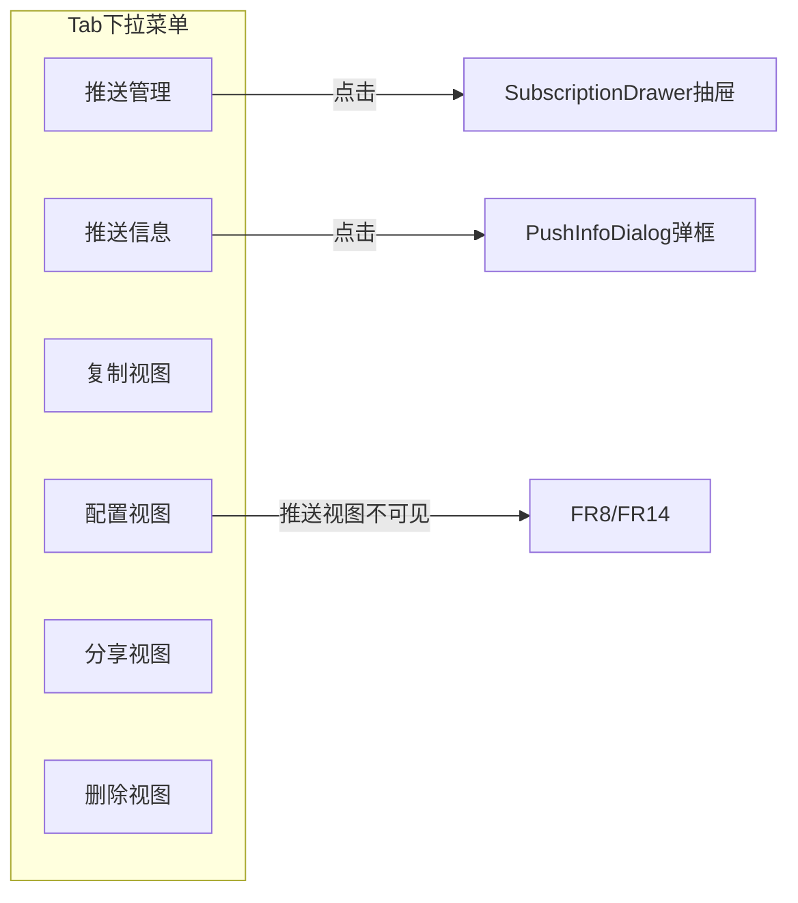
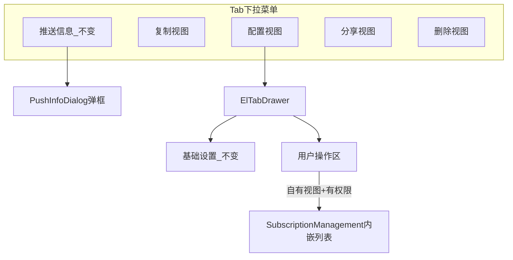

# 视图推送功能入口迁移 — 需求文档

## 1. 背景与目标

### 背景

工序视图页（`JsViewPage` / `ElTabsPage`）在 **tab 下拉菜单** 中提供了两项推送相关能力：

- **推送管理**：管理当前视图的推送订阅人（添加/取消推送）→ **本期迁移**
- **推送信息**：查看推送视图的来源信息 → **本期不动，维持 tab 下拉**

### 目标

- **收拢推送管理入口**：从 tab 下拉迁移至 **「配置视图 → 用户操作 → 推送管理」**
- **推送管理交互**：不打开二级抽屉，在配置抽屉内 **直接内嵌 `SubscriptionManagement` 列表**
- **基础设置不变**：[`BasicForm.vue`](sdp-ui/src/common-ui-test/components/JsViewPage/ElTabDrawerForms/built-in/BasicForm.vue) **不做任何功能增改**（视图名、分组、冻结列等保持原样）
- **推送信息不变**：仍通过 tab 下拉 → [`PushInfoDialog`](sdp-ui/src/common-ui-test/components/JsViewPage/WorkstepView/Subscription/PushInfoDialog.vue) 弹框查看

### 改造范围

- **主要范围**：[`sdp-ui/src/common-ui-test/`](sdp-ui/src/common-ui-test/)
- **配置注入**：[`sdp-ui/src/views/base/tablePage/view.config.js`](sdp-ui/src/views/base/tablePage/view.config.js)
- **暂不包含**：`sdp-common-ui`、推送信息相关改造

---

## 2. 现状（As-Is）



| 入口 | 位置 | 组件 | 本期 |
| ---- | ---- | ---- | ---- |
| 推送管理 | tab 下拉 | `SubscriptionDrawer` | **迁移** |
| 推送信息 | tab 下拉 | `PushInfoDialog` | **不动** |
| 配置视图 | tab 下拉 | `ElTabDrawer` | 推送视图仍不可见（`!currentPushInfo`） |
| 基础设置 | 配置抽屉内 | `BasicForm` | **不动** |

---

## 3. 目标态（To-Be）



### 3.1 推送管理（自有视图）— 本期改造

| 项 | 说明 |
| --- | --- |
| **新入口** | 配置视图 → **用户操作** → 「推送管理」锚点 |
| **交互** | 内嵌 [`SubscriptionManagement`](sdp-ui/src/common-ui-test/components/JsViewPage/WorkstepView/Subscription/SubscriptionManagement.vue)，**不使用 `SubscriptionDrawer`** |
| **显隐** | ① `canManageSubscription` 为 true；② 非推送视图；③ `tabMenuVisibility.manageSubscription !== false` |
| **从 tab 移除** | 「推送管理」菜单项、顶层 `SubscriptionDrawer` |
| **副作用** | 推送变更后 `getViews(workstepId)` 刷新列表 |

### 3.2 推送信息 — 本期不改造

| 项 | 说明 |
| --- | --- |
| **入口** | 仍为 tab 下拉 → `PushInfoDialog` |
| **显隐** | `pushInfo` + `currentPushInfo`（PUSH 视图），逻辑不变 |
| **基础设置** | **不增加**推送信息展示 |

### 3.3 基础设置 — 本期不改造

`BasicForm` 保持现有字段与布局，不新增任何推送相关 UI。

> 注：当前代码第 48 行有无效片段 `isPushView = computed(...)`，若实施时触及该文件可顺带删除；**不作为本期功能需求**。

### 3.4 推送视图与其他 tab 菜单 — 维持现状

| 菜单项 | 推送视图 | 说明 |
| ---- | -------- | ---- |
| 推送信息 | 可见 | 不变 |
| 配置视图 | **仍隐藏** | `!currentPushInfo`，与改前一致 |
| 分享 / 删除 | 隐藏 | FR8/FR14，不变 |

---

## 4. 用户路径对比

```
【改前】
tab ▼ → 推送管理 → SubscriptionDrawer
tab ▼ → 推送信息 → PushInfoDialog
tab ▼ → 配置视图 → 基础设置（无推送相关内容）

【改后】
tab ▼ → 推送信息 → PushInfoDialog          ← 不变
tab ▼ → 配置视图 → 基础设置                 ← 不变
              └→ 用户操作 → 推送管理（内嵌列表）  ← 新增
tab ▼ → 推送管理                            ← 移除
```

---

## 5. 技术实现要点

### 5.1 涉及文件

| 文件 | 改动 |
| ---- | ---- |
| [`ElTabDrawerForms/index.vue`](sdp-ui/src/common-ui-test/components/JsViewPage/ElTabDrawerForms/index.vue) | 「用户操作」区新增 `id="PushManagement"` + 内嵌 `SubscriptionManagement` |
| [`ElTabDrawer/index.vue`](sdp-ui/src/common-ui-test/components/JsViewPage/ElTabDrawer/index.vue) | `userActions.subAnchor` 有条件增加「推送管理」锚点 |
| [`ElTabsPage/index.vue`](sdp-ui/src/common-ui-test/components/JsViewPage/ElTabsPage/index.vue) | 仅移除「推送管理」+ `SubscriptionDrawer`；**保留**推送信息与 `PushInfoDialog` |
| [`view.config.js`](sdp-ui/src/views/base/tablePage/view.config.js) | 导出 `canManageSubscription` |
| [`BasicForm.vue`](sdp-ui/src/common-ui-test/components/JsViewPage/ElTabDrawerForms/built-in/BasicForm.vue) | **不改动**（可选：清理无效代码行） |

### 5.2 配置项

```js
canManageSubscription,  // view.config.js 导出

tabMenuVisibility.manageSubscription  // 控制用户操作区推送管理区块，默认 true
tabMenuVisibility.pushInfo            // 仍控制 tab 下拉推送信息，默认 true
```

### 5.3 组件引用变化

| 组件 | 改造后 |
| ---- | ------ |
| `SubscriptionManagement` | 内嵌于 `ElTabDrawerForms` |
| `SubscriptionDrawer` | `ElTabsPage` 不再引用 |
| `PushInfoDialog` | `ElTabsPage` **继续引用**，逻辑不变 |

### 5.4 `useViewSubscription` 精简（ElTabsPage）

可移除：`subDrawerOpen`、`subViewId`、`openSubscription`

**保留**：`pushInfoOpen`、`currentPushInfo`（推送信息 tab 入口 + 分享/删除/配置视图显隐）

---

## 6. 待确认项

1. **用户操作区锚点顺序**：「推送管理」放在指标卡前还是自定义操作后？（默认：用户操作区 **最前**）
2. **是否同步 `sdp-common-ui`**

---

## 7. 验收标准

- [ ] tab 下拉 **无**「推送管理」，**仍有**「推送信息」（PUSH 视图）
- [ ] 自有视图 + 有权限：配置视图 → 用户操作 → 推送管理，内嵌列表功能与改前抽屉一致
- [ ] **基础设置**内容与改前完全一致，无推送信息区块
- [ ] 推送视图：tab 仍不可打开配置视图；推送信息仍从 tab 下拉打开
- [ ] 配置抽屉内不出现 `SubscriptionDrawer`
- [ ] 推送变更后视图列表正确刷新
